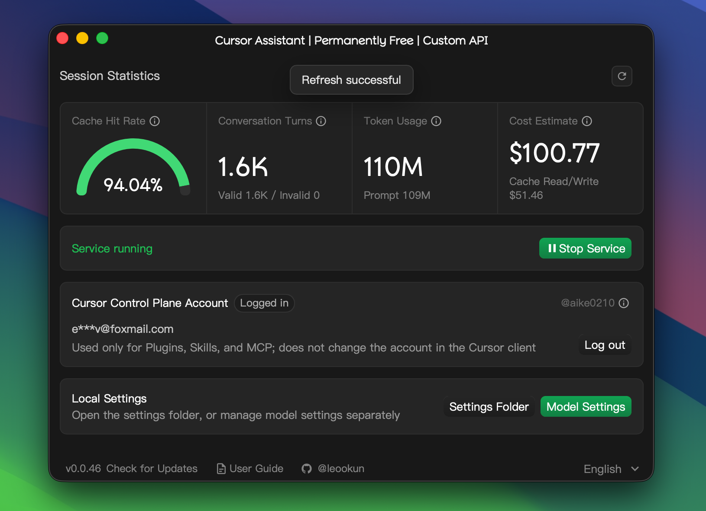

<div align="center">

# cursor-byok
cursor-byok is a local implementation of Cursor's backend.
<br>
<br>
[Upstream project](https://github.com/leookun/cursor-byok) · [Report an Issue](https://github.com/leookun/cursor-byok/issues) · [中文版本说明](./README-CN.md)

[](./LICENSE)
[](https://github.com/leookun/cursor-byok/releases/latest)


</div>

> This is a personal modification of [leookun/cursor-byok](https://github.com/leookun/cursor-byok).
> The upstream ad service, ad asset cache, and ad entry points have been removed; the remaining source is provided under the original project license.




## About

cursor-byok is an open-source local model gateway for Cursor. It runs a service on your machine that connects Cursor to the model APIs you configure, routes model requests through your own providers, and preserves Cursor Agent capabilities such as tool calling, Skills, and MCP.

You can connect OpenAI- and Anthropic-compatible services, customize endpoints, model IDs, API keys, and request parameters, and use model channels beyond the options built into the platform.

> [!IMPORTANT]
> cursor-byok is free and open source, but the model APIs you connect may charge for usage. This is an independent project and is not affiliated with or endorsed by Cursor or its developers.

## Features

- **Bring your own model channels:** Configure your own API endpoint, credentials, and model IDs.
- **Multiple API protocols:** Use OpenAI- and Anthropic-compatible APIs or a custom endpoint.
- **Model management:** Add, duplicate, edit, reorder, and batch-test multiple model configurations.
- **Connection benchmarks:** Measure time to first token, generation speed, and inspect raw provider responses.
- **Agent workflows:** Keep tool calling, Skills, MCP, and multi-turn conversations available.
- **Session metrics:** Track token usage, cache hit rate, conversation turns, and estimated value.
- **Cross-platform:** Run on macOS, Windows, and Linux.

## Quick Start

1. Download the latest build for your platform from [GitHub Releases](https://github.com/leookun/cursor-byok/releases/latest).
2. Launch cursor-byok, open **Model Settings**, and enter the endpoint, API key, and model ID.
3. Test the model configuration. Once it passes, return to the dashboard and start the service.
4. Open Cursor, select the configured model, and start using Agent.

## Model Management

Model configurations support both OpenAI and Anthropic API protocols. Each model channel can independently define its context window, maximum output tokens, reasoning effort, custom headers, and additional request parameters.


## How It Works

```text
Cursor client
    │
    │ Agent requests and tool results
    ▼
cursor-byok local service
    │
    │ OpenAI- / Anthropic-compatible requests
    ▼
Your model API
```

cursor-byok handles protocol adaptation, model request forwarding, tool-call coordination, and conversation state on your machine. API keys and application settings are stored locally; requests are still sent to the model provider you configure.

## Source Repository

This project is a modified fork of [leookun/cursor-byok](https://github.com/leookun/cursor-byok).

The upstream project is an open-source local implementation of Cursor's backend. It runs on your machine and connects Cursor to the model APIs you configure, allowing you to choose compatible providers, model IDs, endpoints, API keys, and request parameters while retaining Cursor Agent capabilities such as tool calling, Skills, and MCP.

This fork removes the upstream advertisement service, advertisement asset cache, and advertisement entry points. The remaining source code and original license notices are preserved. For the upstream project's original roadmap, documentation, issues, and contributor history, please visit the [source repository](https://github.com/leookun/cursor-byok).

## License

This project is open source under the [MIT License](./LICENSE).


